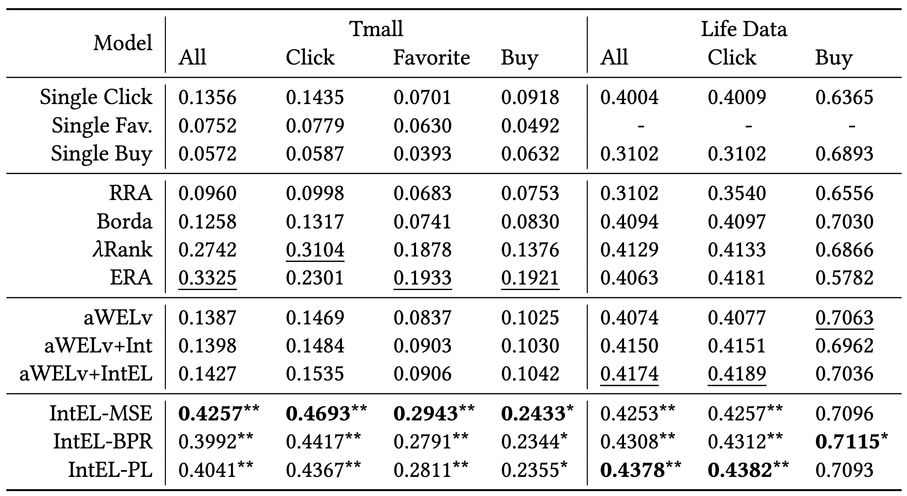

# IntEL: Intent-aware ranking Ensemble Learning

## Introduction
This repository contains the offical implementation of our SIGIR 2023 paper:
  - [Jiayu Li, et al. "IntEL-Intent-aware Ranking Ensemble for Personalized Recommendation". SIGIR 2023.](https://arxiv.org/abs/2304.07450)

In this paper, we propose a novel ranking ensemble method IntEL for intent-aware single-objective ranking lists aggregation. 
To our knowledge, we are the first to generalize ranking ensemble learning with item-level weights on heterogeneous item lists. And we are also the first to integrate user intents into rank aggregation in recommendation.

## Requirements
- python 3.6
- torch==1.7.1
- pygad==2.19.2
- numpy, pandas, scikit_learn, scipy, tqdm
> All will be installed by `requirements.txt`

## Quick Start
The implementation configs of all baseline models and our model IntEL are shown in `./IntEL/script/`.
```
cd ./IntEL/script/
bash IntEL.sh
base baselines.sh
```
You can use self-defined configs and dataset by running `./IntEL/src/main.py`.
```
python main.py --model_name IntEL --datapath ${YOUR_DATASET_PATH} --dataname ${YOUR_DATASET_NAME}
```

## Repository Structure

### Data Preparation
- `Dataset/`
  - It includes the data format, preprocessing, and basic model training process of `Tmall` dataset.

### Model Implementation
- `IntEL/`
  - `IntEL/data/`: includes a toy dataset used for ranking ensemble learning, which is sampled from `Tmall` dataset (The whole dataset is omitted since it's too large). To train a model with *IntEL*, session-level interactions, user and item metadata, and groud truth of intents are necessary.
  - `IntEL/src/`: implementation codes of *IntEL* and all baseline models. Names of item/user/context features and basic lists need re-definition in `helpers/BaseReader.py` and `helpers/SeqReader.py` when applying to new datasets.
  - `IntEL/script/`: includes running configs of all methods that were reported in the paper.

### Appendix
- `Appendix/`
  - `Appendix/Appendix-Proof.pdf`: Proof of Theorem 2 (BPR loss) and Theorem 3 (P-L loss) in the paper.

## Results
Results of `Tmall` and `LifeData` with baseline models and IntEL (by NDCG@3):


Please refer to our paper for more results and in-depth analysis of the results.

## Citation
If you find our work useful, please do not save your star and cite our work:
```
@article{li2023intent,
  title={Intent-aware Ranking Ensemble for Personalized Recommendation},
  author={Li, Jiayu and Sun, Peijie and Wang, Zhefan and Ma, Weizhi and Li, Yangkun and Zhang, Min and Feng, Zhoutian and Xue, Daiyue},
  journal={arXiv preprint arXiv:2304.07450},
  year={2023}
}
```
